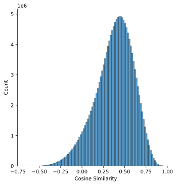
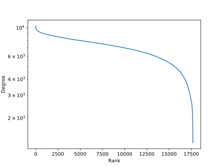

# INDRA2Vec Similarity

The INDRA2Vec embeddings were done on the INDRA database dump with a minimum belief cutoff of 0.2 using the node2vec
model. The similarities are calculated with the cosine metric to match the way the underlying word2vec model was
trained.

Download this data as a three column TSV [here](https://www.synapse.org/Portal/filehandleassociation?associatedObjectId=syn25928962&associatedObjectType=FileEntity&fileHandleId=78460350).
The columns are chemical 1 compact URI (string), chemical 2 compact URI (string), cosine similarity (float). There
is no header row.

## Artifacts

The following image shows the distribution of cosine similarities. Note, the cosine similarity is
appropriate for vectors in euclidean space and is related to the angle between the vectors. It
can take the values on [-1, 1] where -1 is very dissimilar and 1 is very similar.



The weighted degree distribution is calculated as the sum of absolute values of weights to all other
nodes.



When fitting a simple exponential of the form `y = Ae^(bx)`, a `b` between [-2, -3] corresponds to
networks with scale-free characteristics. [Maggiora and Bajorath (2015)](https://pubmed.ncbi.nlm.nih.gov/24925682/)
suggested applying a similarity cutoff such that a network took these characteristics in order to
improve explorability/interpretability.

## Installation

1. Install `indra2vec` using the instructions at https://github.com/indralab/indra2vec. This code is not yet public, so
   please contact [@cthoyt](https://github.com/cthoyt) if you don't already have access.
2. Install the other requirements with `pip install -r requirements.txt`
3. Generate the calculations with `python main.py calculate`
4. Make sure you have an appropriate Synapse configuration file at `~/.config/synapse.ini` with
   
   ```ini
   [synapse]
   username = ...
   password = ...
   ```

   Unfortunately, the API key authentication is currently broken on Synapse.
4. Upload to [Synapse](https://www.synapse.org/#!Synapse:syn25928953/files/) with `python main.py upload`